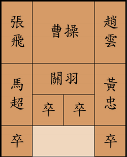

# HUARONGDAO-SOLUTION

## What it does
HUARONGDAO-SOLUTION is an AI solver in a puzzle-solving game named Huarongdao, which solves 80 classic puzzles within 2 minutes.

## How do I do it
- apply A* searching algorithm with cutting branches to find solution and exhibit the solving process using D3 libraries
- improve searching algorithm efficiently largely by 62% through Zobrist hashing with additional infrastructure design
